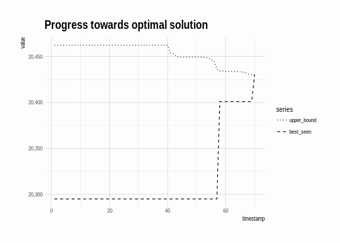
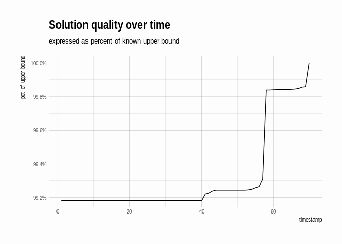
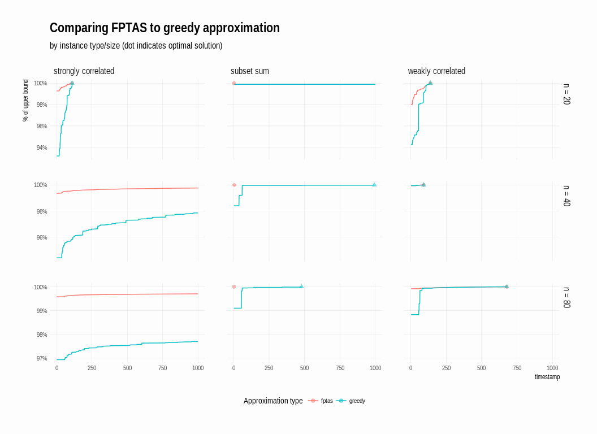

## Lazy lists and branch-and-bound

This essay introduces the branch-and-bound search strategy in the context of the knapsack problem. The first two sections introduce the knapsack problem and implement branch-and-bound using lazily evaluated lists to find the optimal solution to a sample problem.  Next, "Analyzing the algorithm" introduces a couple of visualizations for evaluating the search process. The last two sections explore an alternative method for calcuting bounds, and visualize how the choice of bounding function affects the quality of the resulting solution. The section "Detour: an exact solution" presents a completely different approach to solving the knapsack, and in this essay is only valuable because it leads to the improved bounds-approximation method introduced in the following section.

-   [The Knapsack problem](#the-knapsack-problem)
-   [Branch and bound](#branch-and-bound)
    -   [Search strategy](#search-strategy)
    -   [Search nodes and branching](#search-nodes-and-branching)
    -   [Greedy: a simple bounding
        function](#greedy-a-simple-bounding-function)
    -   [Generating the solution](#generating-the-solution)
-   [Analyzing the algorithm](#analyzing-the-algorithm)
-   [Detour: an exact solution](#detour-an-exact-solution)
-   [Better approximations during
    branch-and-bound](#better-approximations-during-branch-and-bound)
-   [Comparisons](#comparisons)

The Knapsack problem
--------------------

The [knapsack problem](https://en.wikipedia.org/wiki/Knapsack_problem),
in its simplest form, asks: given a sack with a maximum carrying
capacity, and a set of items of varying weights and values, take a
subset of the items that has the highest total value but that still fits
in the sack. The puzzlr package includes functions to create instances
of the knapsack problem:

~~~~ r
library(puzzlr)
set.seed(97317)
ks <- weakly_correlated_instance(n = 50)
ks
~~~~

    ## knapsack
    ## capacity: 19726 
    ##    items: 50 
    ## ..id.. weight value 
    ##     46     50   128
    ##     14     26    59
    ##     41     75   117
    ##     49    195   284
    ##     50    184   266
    ##     36    184   260
    ##    ...
    ## Taken items: 0 
    ## Total value: 0

Each instance consists of a `capacity` and a set of `items`:

~~~~ r
capacity(ks)
~~~~

    ## [1] 19726

~~~~ r
items(ks)
~~~~

    ## # A tibble: 50 x 3
    ##       id weight value
    ##  * <int>  <int> <dbl>
    ##  1    46     50 128  
    ##  2    14     26  59.0
    ##  3    41     75 117  
    ##  4    49    195 284  
    ##  5    50    184 266  
    ##  6    36    184 260  
    ##  7    28    277 355  
    ##  8     7    220 277  
    ##  9    35    330 387  
    ## 10    33    195 222  
    ## # ... with 40 more rows

By default, items in knapsack instances are ordered in decreasing order
of value per unit weight, or density. The top item for a given knapsack
instance can be accessed with the `next_item` function:

~~~~ r
next_item(ks)
~~~~

    ## $id
    ## [1] 46
    ## 
    ## $weight
    ## [1] 50
    ## 
    ## $value
    ## [1] 128

Given a knapsack instance, a new instance can be created by either
taking or leaving the next item, leaving a sub problem:

~~~~ r
take_next(ks)
~~~~

    ## knapsack
    ## capacity: 19676 
    ##    items: 49 
    ## ..id.. weight value 
    ##     14     26    59
    ##     41     75   117
    ##     49    195   284
    ##     50    184   266
    ##     36    184   260
    ##     28    277   355
    ##    ...
    ## Taken items: 1 
    ## Total value: 128

~~~~ r
leave_next(ks)
~~~~

    ## knapsack
    ## capacity: 19726 
    ##    items: 49 
    ## ..id.. weight value 
    ##     14     26    59
    ##     41     75   117
    ##     49    195   284
    ##     50    184   266
    ##     36    184   260
    ##     28    277   355
    ##    ...
    ## Taken items: 0 
    ## Total value: 0

~~~~ r
sub_problems(ks)
~~~~

    ## [[1]]
    ## knapsack
    ## capacity: 19676 
    ##    items: 49 
    ## ..id.. weight value 
    ##     14     26    59
    ##     41     75   117
    ##     49    195   284
    ##     50    184   266
    ##     36    184   260
    ##     28    277   355
    ##    ...
    ## Taken items: 1 
    ## Total value: 128
    ## [[2]]
    ## knapsack
    ## capacity: 19726 
    ##    items: 49 
    ## ..id.. weight value 
    ##     14     26    59
    ##     41     75   117
    ##     49    195   284
    ##     50    184   266
    ##     36    184   260
    ##     28    277   355
    ##    ...
    ## Taken items: 0 
    ## Total value: 0

In this way, one can exhaustively enumerate all subsets of items: with
the original problem as a root node, create two branches based on the
subproblems `take_next(ks)` and `leave_next(ks)`, and then construct
each of their two subproblems, and so on until there are no more items
left to consider. The optimal solution is found in one of the leaf nodes
of the tree -- among those leaf nodes whose aggregate weight does not
exceed `capacity(ks)`, it is the one that maximizes the total value.
Given n items, there are 2*n* leaf nodes. So how can one find
the optimal solution in a reasonable amount of time?

Branch and bound
----------------

[Branch and bound](https://en.wikipedia.org/wiki/Branch_and_bound) is a
family of algorithms for finding the provably optimal solution of a
problem like the knapsack that can be represented in terms of branching
sub-problems. In the case of the knapsack problem, given a fast way to
estimate upper and lower bounds on the true optimum for a sub-problem,
prune the search tree during its construction:

-   Keep track of the best lower bound seen so far.
-   When branching, if one of the subproblems has an upper bound that is
    lower than the best lower bound seen so far, prune the tree -- there
    is no need to continue exploring that path.

The lazily evaluated lists from the
[lazylist](https://github.com/tarakc02/lazylist) package provide an
appealing way to implement branch-and-bound, due to the ability to
define data structures recursively. I'll start with the high-level
implementation and then fill in the details. I use the `empty_stream()`
to prune or terminate a search path, and merge multiple search paths
into one by using a `search_strategy` that prioritizes search nodes:

~~~~ r
library(lazylist)
solution_tree <- function(root, 
                          branch,
                          search_strategy, # e.g. best-first, depth-first
                          best_so_far) {
    branches <- branch(root)
    if (length(branches) == 0) return(empty_stream())
    
    explore_and_prune <- function(node) {
        if (upper_bound(node) < best_so_far) return(empty_stream())
        new_best <- max(best_so_far, lower_bound(node))
        cons_stream(node,
                    solution_tree(node,
                                  branch = branch,
                                  search_strategy = search_strategy,
                                  best_so_far = new_best))
    }
    branches <- purrr::map(branches, explore_and_prune)
    purrr::reduce(branches, search_strategy)
}
~~~~

### Search strategy

A search strategy should be a function that takes two lazy-lists (or
"streams") and merges them into one. Since it's being applied repeatedly
at every branch, I like to visualize its effect as braiding or
interleaving all of the branches together. The result is a single stream
of search nodes, with ordering dependent on the search strategy. There
are multiple search strategies I might implement this way:
breadth-first, depth-first, etc. As a first example, I'll implement
best-first search, in which, at each stage of the search, the "best"
node is considered, with "best" defined as the node with the highest
`upper_bound`. Again, the ability to define things recursively helps --
`best_first` is defined as taking the better of the two head elements of
two streams, along with the `best_first` of the remaining elements of
both streams:

~~~~ r
best_first <- function(s1, s2) {
    if (is_emptystream(s1)) return(s2)
    if (is_emptystream(s2)) return(s1)
    node1 <- stream_car(s1)
    node2 <- stream_car(s2)
    if (upper_bound(node1) >= upper_bound(node2)) {
        return(cons_stream(node1, 
                           best_first(stream_cdr(s1), s2) ))
    }
    cons_stream(node2, 
                best_first(s1, stream_cdr(s2)) )
}
~~~~

### Search nodes and branching

I still need a way to create search nodes that have `upper_bound` and
`lower_bound` methods. I'll define a search node as a knapsack instance
with some additional information tacked on.

~~~~ r
search_node <- function(ks, bounds) {
    # if there are no items left, then we can't add any more value
    if (n_items(ks) == 0) return(
        list(problem = ks,
             upper_bound = total_value(ks),
             lower_bound = total_value(ks))
    )
    b <- bounds(ks)
    list(problem = ks, 
         upper_bound = b$upper_bound,
         lower_bound = b$lower_bound)
}
upper_bound <- function(node) node$upper_bound
lower_bound <- function(node) node$lower_bound
~~~~

### Greedy: a simple bounding function

I've so far been working under the assumption that there is a quick way
to estimate the upper and lower bounds of a knapsack instance. There are
various trivial bounds to a problem, for instance a lower bound of 0, or
an upper bound equal to the sum of values of all of items. I'm looking
for two qualities from a bounding function, and they are in conflict
with one another:

-   it should be fast to calculate, since it's calculated for every node
    in the search tree
-   it should give tight bounds: for a given node, a tighter upper bound
    makes it more likely to be pruned, while a tighter lower bound makes
    all other nodes more likely to be pruned. The more nodes that are
    pruned, the quicker the search.

Since items are already sorted in order of density, I can take items one
at a time until the knapsack is full, giving a decent lower bound. To
get an upper bound, I consider an easier to solve problem: what is the
most value possible if I'm allowed to take fractional items? Taking
items in order of density and then taking a fraction of the next item
will result in a total value that is no less than the true optimum. The
`greedy` function calculates both bounds, and also returns the remaining
sub-problem after achieving the lower bound:

~~~~ r
greedy <- function(ks) {
    item <- next_item(ks)
    
    # if the only remaining item doesn't fit
    if (n_items(ks) == 1 && item$weight > capacity(ks)) return(
        list(lower_bound = total_value(ks),
             upper_bound = total_value(ks),
             remaining = leave_next(ks))
    )
    
    remaining <- ks
    while (!is.null(item) && 
           item$weight <= capacity(remaining)) {
        remaining <- take_next(remaining)
        item <- next_item(remaining)
    }
    lower_bound <- total_value(remaining)
    
    upper_bound <- lower_bound
    if (capacity(remaining) > 0 && !is.null(item)) {
        partial_amount <- capacity(remaining) / item$weight
        upper_bound <- upper_bound + (partial_amount * item$value)
    }
    
    list(lower_bound = lower_bound,
         upper_bound = upper_bound,
         remaining = remaining)
}

greedy(ks)
~~~~

    ## $lower_bound
    ## [1] 20295
    ## 
    ## $upper_bound
    ## [1] 20462.29
    ## 
    ## $remaining
    ## knapsack
    ## capacity: 192 
    ##    items: 11 
    ## ..id.. weight value 
    ##     13    373   325
    ##     39    579   480
    ##     22    267   220
    ##     34    496   402
    ##      3    405   325
    ##     18    402   321
    ##    ...
    ## Taken items: 39 
    ## Total value: 20295

~~~~ r
# the root of the search tree for ks:
search_node(ks, bounds = greedy)
~~~~

    ## $problem
    ## knapsack
    ## capacity: 19726 
    ##    items: 50 
    ## ..id.. weight value 
    ##     46     50   128
    ##     14     26    59
    ##     41     75   117
    ##     49    195   284
    ##     50    184   266
    ##     36    184   260
    ##    ...
    ## Taken items: 0 
    ## Total value: 0
    ## $upper_bound
    ## [1] 20462.29
    ## 
    ## $lower_bound
    ## [1] 20295

### Generating the solution

I now have all of the necessary components of a knapsack solver:

~~~~ r
solve_knapsack <- function(ks, bounds, search_strategy) {
    root <- search_node(ks, bounds = bounds)
    # branch function takes a search node and returns its children
    branch <- function(node) {
        subprobs <- sub_problems(node$problem)
        purrr::map(subprobs, search_node, bounds = bounds)
    }
    
    cons_stream(root, 
                solution_tree(root, 
                              branch = branch,
                              search_strategy = search_strategy,
                              best_so_far = root$lower_bound))
}

solution <- solve_knapsack(ks, bounds = greedy, 
                           search_strategy = best_first)
solution[50]
~~~~

    ## $problem
    ## knapsack
    ## capacity: 1722 
    ##    items: 13 
    ## ..id.. weight value 
    ##     25    651   576
    ##     42    763   674
    ##     13    373   325
    ##     39    579   480
    ##     22    267   220
    ##     34    496   402
    ##    ...
    ## Taken items: 36 
    ## Total value: 18931
    ## $upper_bound
    ## [1] 20449.36
    ## 
    ## $lower_bound
    ## [1] 20181

Since I'm using best-first search, I know that the first node that I see
whose upper bound and lower bound are equal must be the optimal
solution, because the upper bound at any given moment is the highest
known upper bound for the entire problem.

~~~~ r
optimal <- stream_which(solution, 
                        function(x) upper_bound(x) == lower_bound(x))
optimal <- optimal[1]
optimal
~~~~

    ## [1] 70

~~~~ r
solution[optimal]
~~~~

    ## $problem
    ## knapsack
    ## capacity: 11859 
    ##    items: 29 
    ## ..id.. weight value 
    ##      1    700   731
    ##     24    299   312
    ##     29    399   411
    ##     20    852   862
    ##      5    286   289
    ##     26    584   588
    ##    ...
    ## Taken items: 20 
    ## Total value: 9029
    ## $upper_bound
    ## [1] 20430
    ## 
    ## $lower_bound
    ## [1] 20430

In order to actually see the items that were taken, I need to follow the
solution down the tree to the leaf node, which is when there are no more
items in the remaining sub-problem:

~~~~ r
solution_items <- solution %>% 
    stream_filter(function(x) n_items(x$problem) == 0) %>%
    purrr::pluck(1, "problem") %>% 
    taken_items
solution_items
~~~~

    ## # A tibble: 39 x 3
    ##       id weight value
    ##    <int>  <int> <dbl>
    ##  1    13    373   325
    ##  2    42    763   674
    ##  3    25    651   576
    ##  4    37    655   590
    ##  5     8    822   741
    ##  6    31    669   627
    ##  7    27    612   582
    ##  8    47    941   895
    ##  9    40    884   847
    ## 10    15    116   114
    ## # ... with 29 more rows

~~~~ r
# check that we are within capacity and that items sum to optimal value
dplyr::summarise(solution_items, w = sum(weight), v = sum(value))
~~~~

    ## # A tibble: 1 x 2
    ##       w     v
    ##   <int> <dbl>
    ## 1 19726 20430

Analyzing the algorithm
-----------------------

The `solution` object contains the full search history, starting from
the original problem at `solution[1]` to the solution on step 70.

~~~~ r
library(tidyverse)
solution_df <- data_frame(
    timestamp = seq_len(optimal),
    lower_bound = stream_map(solution, lower_bound) %>% 
        as.list(from = 1, to = optimal) %>% as.numeric,
    upper_bound = stream_map(solution, upper_bound) %>%
        as.list(from = 1, to = optimal) %>% as.numeric) %>%
    mutate(best_seen = cummax(lower_bound))
solution_df
~~~~

    ## # A tibble: 70 x 4
    ##    timestamp lower_bound upper_bound best_seen
    ##        <int>       <dbl>       <dbl>     <dbl>
    ##  1         1       20295       20462     20295
    ##  2         2       20295       20462     20295
    ##  3         3       20295       20462     20295
    ##  4         4       20295       20462     20295
    ##  5         5       20295       20462     20295
    ##  6         6       20295       20462     20295
    ##  7         7       20295       20462     20295
    ##  8         8       20295       20462     20295
    ##  9         9       20295       20462     20295
    ## 10        10       20295       20462     20295
    ## # ... with 60 more rows

I can visualize progress towards the solution:

~~~~ r
theme_set(hrbrthemes::theme_ipsum() + 
              theme(plot.background = element_rect(fill = "#fdfdfd",
                                                   colour = NA)))

solution_df %>%
    select(-lower_bound) %>%
    gather(series, value, -timestamp) %>%
    mutate(series = fct_rev(series)) %>%
    ggplot(aes(x = timestamp, y = value)) +
    geom_line(aes(linetype = series)) +
    scale_linetype_manual(values = c("best_seen" = 2, 
                                     "upper_bound" = 3)) +
    scale_y_continuous(labels = scales::comma) +
    ggtitle("Progress towards optimal solution")
~~~~

We don't have to run `solution` until a provably optimal solution -- we
can stop earlier if we like. If we did so, we'd return the `best_seen`
value as the best we could do. In fact, we can calculate the best seen
percent of upper bound at each step, and so even if we stopped early,
we'd be able to report a guarantee on how close the given solution is to
optimal (even though we wouldn't know the true optimal solution). For
instance, by time 60, we know that our best solution is at least 99.8%
of the true optimum:

~~~~ r
solution_df %>%
    mutate(pct_of_upper_bound = best_seen / upper_bound) %>%
    ggplot(aes(x = timestamp, y = pct_of_upper_bound)) +
    geom_line() +
    scale_y_continuous(labels = scales::percent) +
    ggtitle("Solution quality over time",
            "expressed as percent of known upper bound")
~~~~

Detour: an exact solution
-------------------------

In addition to branch-and-bound based solutions, there are a couple of
different [dynamic
programming](https://en.wikipedia.org/wiki/Dynamic_programming) based
solutions to the knapsack. The one I'll explore here breaks the problem
down into sub-problems in a somewhat unintuitive, but ultimately useful
way. First, we re-frame the question: for a given value `v`, and only
considering items 1 through `n`, what is the smallest knapsack (in terms
of capacity) required in order to have items whose values add up to
exactly `v`? We'll create a function `mincap(n, v)` to answer that
question.

I can work out a recursive solution. Assume we know the value of
`mincap` for numbers less than `n`. Then I'm left looking at the nth
item. The solution to `mincap(n, v)` either includes the nth item, in
which case I add the weight of the nth item to the solution of the
resulting subproblem (here `value[n]` is the value of the nth item, and
`weight[n]` is its weight):

~~~~ r
mincap(n, v) == weight[n] + mincap(n - 1, v - value[n])
~~~~

Or does not include the nth item, in which case:

~~~~ r
mincap(n, v) == mincap(n - 1, v)
~~~~

Whether to include or exclude the nth item depends on which of those two
expressions evaluates to a smaller amount. Putting those ideas together
in a function, I get:

~~~~ r
mincap <- function(n, v) {
    if (v == 0) return(0)
    if (n == 0) return(Inf)
    
    if (value[n] > v) {
        mincap(n - 1, v)
    } else {
        min(mincap(n - 1, v),
            weight[n] + mincap(n - 1, v - value[n]))
    }
}
~~~~

But what does any of this have to do with solving the knapsack? Well, if
I know some `max_value` that is achievable in this instance of the
knapsack (an upper bound, that is), then I can try
`mincap(n_items(ks), k)` for decreasing values of `k` until I find one
whose result is less than or equal to `capacity(ks)`, thus discovering
the optimal value for the knapsack (here `num_items` is the number of
items in the instance, and `capacity` is its capacity):

~~~~ r
k <- max_value(ks)
while (mincap(num_items, k) > capacity) k <- k - 1
~~~~

I can use `greedy` to find an upper bound (the `max_value`). So I have
just about everything I need.

There's still one problem: I'm re-calculating `mincap` over and over for
the same inputs. To get the value of `mincap(n, v)` I need to calculate

-   `mincap(n - 1, v)`
-   as well as `mincap(n - 1, v - value[n])`
-   and so on

This is an instance where caching, or memoization, can make a big
difference. Since `mincap` has two integer arguments and an integer
output, I can use a matrix to store already-calculated values -- looking
up a single value in a matrix can be done very quickly. So implementing
all of the ideas, my overall function now looks like:

~~~~ r
exact_solution <- function(ks) {
    num_items <- n_items(ks) 
    items <- items(ks)
    
    capacity <- capacity(ks)
    weight <- items$weight
    value <- items$value
    max_value <- floor(greedy(ks)$upper_bound)
    
    cache <- matrix(nrow = num_items, ncol = max_value, 
                    data = NA_integer_)
    
    mincap <- function(n, v) {
        if (v == 0) return(0)
        if (n == 0) return(Inf)
        if (!is.na(cache[n, v])) return(cache[n, v])
        
        if (value[n] > v) {
            res <- mincap(n - 1, v)
        } else {
            res <- min(mincap(n - 1, v),
                       weight[n] + mincap(n - 1, v - value[n]))
        }
        cache[n, v] <<- res
        res
    }
    
    k <- max_value
    while (mincap(num_items, k) > capacity) k <- k - 1
    k
}
exact_solution(ks)
~~~~

    ## [1] 20430

I can verify that that is the optimum by comparing to the solution from
the previous section (yes, it is!), but how can I get see the items
taken to get to that value? I can trace my way through the items in
reverse, knowing that the only reason that `mincap(n, v)` would not be
the same as `mincap(n - 1, v)` would be because I took item `n`. I track
back this way, flagging taken items until I've accounted for all of the
optimal solution value.

~~~~ r
exact_solution <- function(ks) {
    num_items <- n_items(ks)
    items <- items(ks)
    
    capacity <- capacity(ks)
    weight <- items$weight
    value <- items$value
    max_value <- floor(greedy(ks)$upper_bound)
    
    cache <- matrix(nrow = num_items, ncol = max_value, 
                    data = NA_integer_)
    
    mincap <- function(n, v) {
        if (v == 0) return(0)
        if (n == 0) return(Inf)
        if (!is.na(cache[n, v])) return(cache[n, v])
        
        if (value[n] > v) {
            res <- mincap(n - 1, v)
        } else {
            res <- min(mincap(n - 1, v),
                       weight[n] + mincap(n - 1, v - value[n]))
        }
        cache[n, v] <<- res
        res
    }
    
    k <- max_value
    while (mincap(num_items, k) > capacity) k <- k - 1
    
    # trace-back to find the items in the solution
    n <- num_items; v <- k
    selected <- vector("logical", num_items)
    
    while(v > 0) {
        if (mincap(n, v) != mincap(n - 1, v)) {
            selected[n] <- TRUE
            v <- v - value[n]
        }
        n <- n - 1
    }

    list(lower_bound = k, upper_bound = k,
         remaining = take_items(ks, items$id[selected]))
}
~~~~

And now I do see that I get the same solution as in the previous
section:

~~~~ r
exact_solution(ks)
~~~~

    ## $lower_bound
    ## [1] 20430
    ## 
    ## $upper_bound
    ## [1] 20430
    ## 
    ## $remaining
    ## knapsack
    ## capacity: 0 
    ##    items: 0 
    ## ..id.. weight value 
    ## 
    ## Taken items: 39 
    ## Total value: 20430

If we have an exact solution, why bother with branching-and-bounding?
The dimensions of the `cache` matrix in `exact_solution` provide a hint:
`exact_solution` will require space and time proportional to the number
of items times `max_value`. `max_value`, meanwhile, just depends on the
values of the items in the knapsack. We can see this clearly by
comparing execution time among knapsack instances that are essentially
the same, except that the values have been scaled:

~~~~ r
ks1 <- subset_sum_instance(n = 10)
ks2 <- knapsack(capacity = capacity(ks1),
                items = items(ks1) %>% mutate(value = value * 8))
ks3 <- knapsack(capacity = capacity(ks1),
                items = items(ks1) %>% mutate(value = value * 16))
ks4 <- knapsack(capacity = capacity(ks1),
                items = items(ks1) %>% mutate(value = value * 32))

microbenchmark::microbenchmark(
    exact_solution(ks1), 
    exact_solution(ks2), 
    exact_solution(ks3), 
    exact_solution(ks4), 
    times = 10
) %>% print(signif = 1)
~~~~

    ## Unit: milliseconds
    ##                 expr min   lq     mean median   uq  max neval
    ##  exact_solution(ks1)  30   30  28.9307     30   30   40    10
    ##  exact_solution(ks2) 200  200 242.3403    200  200  300    10
    ##  exact_solution(ks3) 500  500 534.6781    500  500  800    10
    ##  exact_solution(ks4) 900 1000 974.0433   1000 1000 1000    10

So, `exact_solution` will not scale very well. However, we can use it to
build a better approximation than `greedy`.

Better approximations during branch-and-bound
---------------------------------------------

In the previous section we saw an algorithm that provides the exact
optimal solution to the knapsack problem, but it does not scale well. In
particular, it gets much slower as the items increase in value, even if
nothing else about the instance changes.

But what would happen if we just scaled the values down? As it turns
out, that is the idea behind a [fully polynomial time approximation
scheme (or
FPTAS)](https://en.wikipedia.org/wiki/Polynomial-time_approximation_scheme)
for the knapsack! If we scale all of the items in a clever way, it can
be shown that the taking the items selected by running the
`exact_solution` on the scaled-down instance will result in a solution
to the unscaled instance that is close to optimal. Specifically, we can
get to within at least 1 − *ϵ* where *ϵ* is a parameter.

~~~~ r
fptas <- function(ks, epsilon) {
    items <- items(ks)
    largest_value <- max(items$value)
    scaling_factor <- epsilon * (largest_value / n_items(ks))
    
    new_values <- floor(items$value / scaling_factor)
    new_items <- items
    new_items$value <- new_values
    
    new_ks <- knapsack(capacity = capacity(ks), items = new_items)
    approximate_solution <- taken_items(exact_solution(new_ks)$remaining)
    if (nrow(approximate_solution) > 0) {
        approximate_solution <- take_items(ks, approximate_solution$id) 
    } else {
        approximate_solution <- ks
    }
    lower_bound <- total_value(approximate_solution)
    upper_bound <- lower_bound / (1 - epsilon)
    list(remaining = approximate_solution,
         lower_bound = lower_bound,
         upper_bound = min(upper_bound, greedy(ks)$upper_bound))
}
~~~~

Notice that `fptas` gives us a tighter lower bound than `greedy`:

~~~~ r
lower_bound(greedy(ks2)) 
~~~~

    ## [1] 30088

~~~~ r
lower_bound(fptas(ks2, epsilon = .3))
~~~~

    ## [1] 33288

And `fptas` is also much faster than `exact_solution`:

~~~~ r
microbenchmark::microbenchmark(
    exact_solution(ks2), 
    fptas(ks2, epsilon = .3), 
    times = 10) %>% print(signif = 1)
~~~~

    ## Unit: milliseconds
    ##                       expr min  lq       mean median  uq max neval
    ##        exact_solution(ks2) 200 200 254.687448    200 300 300    10
    ##  fptas(ks2, epsilon = 0.3)   4   4   4.538809      4   5   6    10

Comparisons
-----------

We now have two bounding functions (`greedy` and `fptas`), and we can
compare how well branch-and-bound performs when using each. The paper
[Where are the hard knapsack
problems?](https://dl.acm.org/citation.cfm?id=1063640) by David Pisinger
describes and categorizes a number of different knapsack problem types
based on their difficulty. Among them are:

-   weakly correlated instances: item values are linearly related to
    their weights, but with some noisiness. These are common in
    management, because "the return of an investment is generally
    proportional to the sum invested within some small variations."
-   strongly correlated instances: item values are a linear function of
    their weights (with no error/noise). These instances are challenging
    because, among other reasons, the greedy upper-bound is often not
    very tight.
-   subset sum instances: item values are equal to their weights, and
    the problem becomes a subset sum problem. These instances are
    challenging because all items have the same density (value per unit
    weight).

The `puzzlr` package provides functions to generate these and other
types of knapsack instances described in the paper. I'll generate
instances of each of the three types described above, with different
numbers of items:

~~~~ r
set.seed(57539)
problems <- expand.grid(
    n = c(20L, 40L, 80L),
    problem_type = c("weakly_correlated_instance",
                     "strongly_correlated_instance",
                     "subset_sum_instance"),
    stringsAsFactors = FALSE) %>% tbl_df %>%
    mutate(arglist = map(n, ~list(n = .x)),
           instance = map2(problem_type, arglist, 
                           ~do.call(.x, args = .y))) %>%
    select(-arglist)
~~~~

I can use `purrr` to generate solutions for each problem.

~~~~ r
solutions <- problems %>%
    mutate(sol_fptas = map(instance, solve_knapsack,
                           bounds = function(x) fptas(x, .3),
                           search_strategy = best_first),
           sol_greedy = map(instance, solve_knapsack,
                            bounds = greedy,
                            search_strategy = best_first))
solutions
~~~~

    ## # A tibble: 9 x 5
    ##       n problem_type                 instance       sol_fptas   sol_greedy
    ##   <int> <chr>                        <list>         <list>      <list>    
    ## 1    20 weakly_correlated_instance   <S3: knapsack> <S3: lazyl… <S3: lazy…
    ## 2    40 weakly_correlated_instance   <S3: knapsack> <S3: lazyl… <S3: lazy…
    ## 3    80 weakly_correlated_instance   <S3: knapsack> <S3: lazyl… <S3: lazy…
    ## 4    20 strongly_correlated_instance <S3: knapsack> <S3: lazyl… <S3: lazy…
    ## 5    40 strongly_correlated_instance <S3: knapsack> <S3: lazyl… <S3: lazy…
    ## 6    80 strongly_correlated_instance <S3: knapsack> <S3: lazyl… <S3: lazy…
    ## 7    20 subset_sum_instance          <S3: knapsack> <S3: lazyl… <S3: lazy…
    ## 8    40 subset_sum_instance          <S3: knapsack> <S3: lazyl… <S3: lazy…
    ## 9    80 subset_sum_instance          <S3: knapsack> <S3: lazyl… <S3: lazy…

I'll create a couple of helper functions to make the rest of the code
clearer -- `find_index` will find the index of the optimal solution, or
stop trying after 1,000 steps, and `to_df` will extract some useful
metrics from the solving process, as we did in the first section.

~~~~ r
find_index <- function(s, max_search = 1000) {
    n <- 1L
    current <- stream_car(s)
    while (n < max_search && 
           upper_bound(current) > lower_bound(current)) {
        s <- stream_cdr(s)
        n <- n + 1L
        current <- stream_car(s)
    }
    n
}

to_df <- function(s) {
    until <- find_index(s)
    data_frame(
        timestamp = seq_len(until),
        lower_bound = stream_map(s, lower_bound) %>% 
            as.list(from = 1, to = until) %>% as.numeric,
        upper_bound = stream_map(s, upper_bound) %>%
            as.list(from = 1, to = until) %>% as.numeric) %>%
        mutate(best_seen = cummax(lower_bound))
}
~~~~

Now I can run branch-and-bound solvers on every problem instance:

~~~~ r
solutions <- solutions %>%
    mutate(fptas = map(sol_fptas, to_df),
           greedy = map(sol_greedy, to_df))
solutions %>% select(n, problem_type, fptas, greedy)
~~~~

    ## # A tibble: 9 x 4
    ##       n problem_type                 fptas                greedy          
    ##   <int> <chr>                        <list>               <list>          
    ## 1    20 weakly_correlated_instance   <tibble [138 × 4]>   <tibble [138 × …
    ## 2    40 weakly_correlated_instance   <tibble [90 × 4]>    <tibble [90 × 4…
    ## 3    80 weakly_correlated_instance   <tibble [677 × 4]>   <tibble [677 × …
    ## 4    20 strongly_correlated_instance <tibble [110 × 4]>   <tibble [110 × …
    ## 5    40 strongly_correlated_instance <tibble [1,000 × 4]> <tibble [1,000 …
    ## 6    80 strongly_correlated_instance <tibble [1,000 × 4]> <tibble [1,000 …
    ## 7    20 subset_sum_instance          <tibble [1 × 4]>     <tibble [1,000 …
    ## 8    40 subset_sum_instance          <tibble [4 × 4]>     <tibble [994 × …
    ## 9    80 subset_sum_instance          <tibble [2 × 4]>     <tibble [480 × …

In several cases, the two solution strategies required the same number
of iterations (visible in the number of rows in each solution data
frame) to get a provably optimal solution. That's because to prove
optimality, I need to show that my solution is better than the upper
bound of any other solution path. `fptas` improved our lower bounds, but
not the upper bounds (exercise for another day: implement stronger upper
bounds). However, the improved lower bounds mean we are able to achieve
a higher "percent of known upper bound" earlier in the process. If we
only needed a solution that was provably close to optimal, without
necessarily being optimal, the better lower bounds `fptas` would allow
us to stop earlier.

~~~~ r
solution_history <- solutions %>% 
    select(n, problem_type, fptas, greedy) %>%
    mutate(problem_type = 
               str_replace_all(problem_type, "_instance", "") %>%
               str_replace_all("_", " ")) %>%
    gather(solution_type, solution, -n, -problem_type) %>%
    unnest %>%
    mutate(n = paste0("n = ", n), 
           pct_of_upper_bound = best_seen / upper_bound)

solution_summary <- solution_history %>% 
    filter(pct_of_upper_bound == 1)

ggplot(solution_history, 
       aes(x = timestamp, 
           y = pct_of_upper_bound,
           colour = solution_type)) +
    geom_line() +
    geom_point(data = solution_summary, size = 2, alpha = .5,
               aes(shape = solution_type)) +
    scale_shape_discrete(guide = "none") +
    scale_y_continuous(labels = scales::percent,
                       name = "% of upper bound") +
    scale_colour_discrete(name = "Approximation type") +
    facet_grid(n ~ problem_type, scales = "free_y") +
    ggtitle("Comparing FPTAS to greedy approximation",
            "by instance type/size (dot indicates optimal solution)") +
    theme(legend.position = "bottom",
          panel.grid.major = element_line(colour = "gray80", size = .1),
          panel.grid.minor = element_blank())
~~~~

The `fptas` strategy really shines on the "strongly correlated" and
"subset sum" knapsack instances: in the former case, though neither
strategy found a provably optimal solution for the larger instances,
`fptas` gave a much higher quality solution from the start than `greedy`
was able to acheive even after 1,000 steps. In the case of subset sum
instances, `fptas` resulted in an optimal solution almost immediately,
while `greedy` labored for many more steps (note it's not quite fair to
compare head-to-head in this way, since `greedy` is much faster than
`fptas`, but the point of this exercise is to explore how bounding
functions can affect the branch-and-bound search -- separate from
optimizing the execution time of the individual bounding functions).
