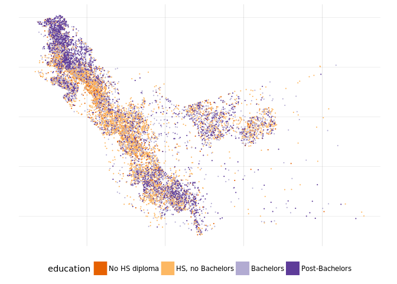
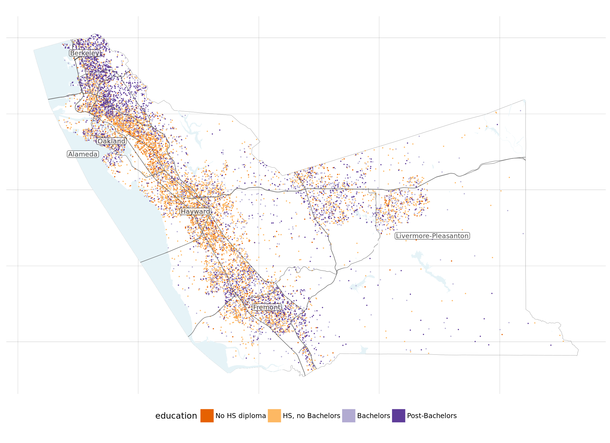

Dot Density maps
================

A [dot-density map](https://en.wikipedia.org/wiki/Dot_distribution_map)
is one way to map aggregated spatial data without some of the
distortions inherent in choropleths. Several recent tools in R, in
particular the `tidycensus` (for demographic data), `tigris` (for
spatial shape files), and `sf` (for manipulating geospatial data)
pacakges. What follows is a short tutorial on creating a dot-density
map, using as an example the distribution of educational attainment in
Alameda County, CA.

Acquiring the data
------------------

I'll use the `tidycensus::get_acs` function to pull the data at the
appropriate geographic level, but first I need to figure out the name of
the table that contains the educational attainment numbers:

~~~~ r
# load libraries
library(sf)
library(tidyverse)
library(tigris)
library(tidycensus)
options(tigris_use_cache=TRUE)
options(tigris_class="sf")
~~~~

~~~~ r
v16 <- load_variables(2016, "acs5", cache = TRUE)
v16 %>%
    mutate(table = str_extract(name, "^.+_")) %>%
    filter(str_detect(concept, "EDUCATIONAL ATTAINMENT")) %>%
    select(table, concept) %>% distinct %>% print(n = Inf)
~~~~

    ## # A tibble: 29 x 2
    ##    table     concept                                                      
    ##    <chr>     <chr>                                                        
    ##  1 B06009_   PLACE OF BIRTH BY EDUCATIONAL ATTAINMENT IN THE UNITED STATES
    ##  2 B06009PR_ PLACE OF BIRTH BY EDUCATIONAL ATTAINMENT IN PUERTO RICO      
    ##  3 B07009_   GEOGRAPHICAL MOBILITY IN THE PAST YEAR BY EDUCATIONAL ATTAIN…
    ##  4 B07009PR_ GEOGRAPHICAL MOBILITY IN THE PAST YEAR BY EDUCATIONAL ATTAIN…
    ##  5 B07409_   GEOGRAPHICAL MOBILITY IN THE PAST YEAR BY EDUCATIONAL ATTAIN…
    ##  6 B07409PR_ GEOGRAPHICAL MOBILITY IN THE PAST YEAR BY EDUCATIONAL ATTAIN…
    ##  7 B13014_   WOMEN 15 TO 50 YEARS WHO HAD A BIRTH IN THE PAST 12 MONTHS B…
    ##  8 B14005_   SEX BY SCHOOL ENROLLMENT BY EDUCATIONAL ATTAINMENT BY EMPLOY…
    ##  9 B15001_   SEX BY AGE BY EDUCATIONAL ATTAINMENT FOR THE POPULATION 18 Y…
    ## 10 B15002_   SEX BY EDUCATIONAL ATTAINMENT FOR THE POPULATION 25 YEARS AN…
    ## 11 B15003_   EDUCATIONAL ATTAINMENT FOR THE POPULATION 25 YEARS AND OVER  
    ## 12 B16010_   EDUCATIONAL ATTAINMENT AND EMPLOYMENT STATUS BY LANGUAGE SPO…
    ## 13 B17003_   POVERTY STATUS IN THE PAST 12 MONTHS OF INDIVIDUALS BY SEX B…
    ## 14 B17018_   POVERTY STATUS IN THE PAST 12 MONTHS OF FAMILIES BY HOUSEHOL…
    ## 15 B20004_   MEDIAN EARNINGS IN THE PAST 12 MONTHS (IN 2016 INFLATION-ADJ…
    ## 16 B21003_   VETERAN STATUS BY EDUCATIONAL ATTAINMENT FOR THE CIVILIAN PO…
    ## 17 B23006_   EDUCATIONAL ATTAINMENT BY EMPLOYMENT STATUS FOR THE POPULATI…
    ## 18 B25013_   TENURE BY EDUCATIONAL ATTAINMENT OF HOUSEHOLDER              
    ## 19 B27019_   HEALTH INSURANCE COVERAGE STATUS AND TYPE BY AGE BY EDUCATIO…
    ## 20 B99151_   ALLOCATION OF EDUCATIONAL ATTAINMENT FOR THE POPULATION 25 Y…
    ## 21 C15002A_  SEX BY EDUCATIONAL ATTAINMENT FOR THE POPULATION 25 YEARS AN…
    ## 22 C15002B_  SEX BY EDUCATIONAL ATTAINMENT FOR THE POPULATION 25 YEARS AN…
    ## 23 C15002C_  SEX BY EDUCATIONAL ATTAINMENT FOR THE POPULATION 25 YEARS AN…
    ## 24 C15002D_  SEX BY EDUCATIONAL ATTAINMENT FOR THE POPULATION 25 YEARS AN…
    ## 25 C15002E_  SEX BY EDUCATIONAL ATTAINMENT FOR THE POPULATION 25 YEARS AN…
    ## 26 C15002F_  SEX BY EDUCATIONAL ATTAINMENT FOR THE POPULATION 25 YEARS AN…
    ## 27 C15002G_  SEX BY EDUCATIONAL ATTAINMENT FOR THE POPULATION 25 YEARS AN…
    ## 28 C15002H_  SEX BY EDUCATIONAL ATTAINMENT FOR THE POPULATION 25 YEARS AN…
    ## 29 C15002I_  SEX BY EDUCATIONAL ATTAINMENT FOR THE POPULATION 25 YEARS AN…

I'll be using table `B15003`: "EDUCATIONAL ATTAINMENT FOR THE POPULATION
25 YEARS AND OVER". Note that that means that my map will be ignoring
the existence of children.

Next I pull the data. By including `geometry = TRUE` in the `get_acs`
call, I automatically get an `sf` object that includes the associated
geometry along with the demgoraphic data. The state/county codes are
FIPS codes:

~~~~ r
acs <- get_acs("tract", table = "B15003", cache_table = TRUE,
               geometry = TRUE, state = "06", county = "001",
               year = 2016, output = "tidy")
acs
~~~~

    ## Simple feature collection with 9000 features and 5 fields
    ## geometry type:  MULTIPOLYGON
    ## dimension:      XY
    ## bbox:           xmin: -122.3423 ymin: 37.45419 xmax: -121.4692 ymax: 37.90582
    ## epsg (SRID):    4269
    ## proj4string:    +proj=longlat +datum=NAD83 +no_defs
    ## First 10 features:
    ##          GEOID                                          NAME   variable
    ## 1  06001400200 Census Tract 4002, Alameda County, California B15003_001
    ## 2  06001400200 Census Tract 4002, Alameda County, California B15003_002
    ## 3  06001400200 Census Tract 4002, Alameda County, California B15003_003
    ## 4  06001400200 Census Tract 4002, Alameda County, California B15003_004
    ## 5  06001400200 Census Tract 4002, Alameda County, California B15003_005
    ## 6  06001400200 Census Tract 4002, Alameda County, California B15003_006
    ## 7  06001400200 Census Tract 4002, Alameda County, California B15003_007
    ## 8  06001400200 Census Tract 4002, Alameda County, California B15003_008
    ## 9  06001400200 Census Tract 4002, Alameda County, California B15003_009
    ## 10 06001400200 Census Tract 4002, Alameda County, California B15003_010
    ##    estimate moe                       geometry
    ## 1      1559  89 MULTIPOLYGON (((-122.2574 3...
    ## 2         0  12 MULTIPOLYGON (((-122.2574 3...
    ## 3         0  12 MULTIPOLYGON (((-122.2574 3...
    ## 4         0  12 MULTIPOLYGON (((-122.2574 3...
    ## 5         0  12 MULTIPOLYGON (((-122.2574 3...
    ## 6         0  12 MULTIPOLYGON (((-122.2574 3...
    ## 7         0  12 MULTIPOLYGON (((-122.2574 3...
    ## 8         0  12 MULTIPOLYGON (((-122.2574 3...
    ## 9         8  11 MULTIPOLYGON (((-122.2574 3...
    ## 10        0  12 MULTIPOLYGON (((-122.2574 3...

The educational attainment splits things out to quite a few levels (with
one for "finished 4th grade" and another for "finished 5th grade" and so
on), so I'll collapse them down to a handful of categories.

~~~~ r
acs <- acs %>%
    mutate(
        id = str_extract(variable, "[0-9]{3}$") %>% as.integer
    ) %>%
    mutate(education =case_when(
        id %>% between(2, 16) ~ "No HS diploma",
        id %>% between(17, 21) ~ "HS, no Bachelors",
        id == 22 ~ "Bachelors",
        id > 22 ~ "Post-Bachelors"
    )) %>% filter(!is.na(education)) %>%
    group_by(GEOID, education) %>% 
    summarise(estimate = sum(estimate))
acs
~~~~

    ## Simple feature collection with 1440 features and 3 fields
    ## geometry type:  GEOMETRY
    ## dimension:      XY
    ## bbox:           xmin: -122.3423 ymin: 37.45419 xmax: -121.4692 ymax: 37.90582
    ## epsg (SRID):    4269
    ## proj4string:    +proj=longlat +datum=NAD83 +no_defs
    ## # A tibble: 1,440 x 4
    ## # Groups:   GEOID [360]
    ##    GEOID       education        estimate                       geometry
    ##    <chr>       <chr>               <dbl>         <sf_geometry [degree]>
    ##  1 06001400100 Bachelors           781   POLYGON ((-122.2469 37.8854...
    ##  2 06001400100 HS, no Bachelors    465   POLYGON ((-122.2469 37.8854...
    ##  3 06001400100 No HS diploma        32.0 POLYGON ((-122.2469 37.8854...
    ##  4 06001400100 Post-Bachelors     1200   POLYGON ((-122.2469 37.8854...
    ##  5 06001400200 Bachelors           557   POLYGON ((-122.2574 37.8431...
    ##  6 06001400200 HS, no Bachelors    251   POLYGON ((-122.2574 37.8431...
    ##  7 06001400200 No HS diploma        30.0 POLYGON ((-122.2574 37.8431...
    ##  8 06001400200 Post-Bachelors      721   POLYGON ((-122.2574 37.8431...
    ##  9 06001400300 Bachelors          1332   POLYGON ((-122.2642 37.84, ...
    ## 10 06001400300 HS, no Bachelors   1141   POLYGON ((-122.2642 37.84, ...
    ## # ... with 1,430 more rows

Dot-density maps work by placing dots randomly within the appropriate
geographic boundaries, to approximate the overall distribution of people
in space. The function `sf::st_sample` samples points from within
polygons. It seems like there are different ways of approaching the next
step, what I did was split the data by education level, and then run the
sampling function on each level for each block group. Grouping and
summarizing at the end gets me to 4 multipoint layers, each containing a
number of points. I also re-code the education level to an ordered
factor variable, which will help when plotting:

~~~~ r
acs_split <- acs %>%
    filter(estimate > 50) %>%
    split(.$education)

generate_samples <- function(data) suppressMessages(
    data %>% st_sample(size = round(.$estimate / 100)))

points <- map(acs_split, generate_samples)
points <- imap(points, ~st_sf(data_frame(education = rep(.y, length(.x))),
                         geometry = .x))
points <- do.call(rbind, points)
points <- points %>% group_by(education) %>% summarise()
points <- points %>%
    mutate(education = factor(
        education,
        levels = c("No HS diploma", "HS, no Bachelors",
                   "Bachelors", "Post-Bachelors")))
points %>% mutate(n_points = map_int(geometry, length))
~~~~

    ## Simple feature collection with 4 features and 2 fields
    ## geometry type:  MULTIPOINT
    ## dimension:      XY
    ## bbox:           xmin: -122.3314 ymin: 37.46256 xmax: -121.4945 ymax: 37.90465
    ## epsg (SRID):    4269
    ## proj4string:    +proj=longlat +datum=NAD83 +no_defs
    ## # A tibble: 4 x 3
    ##   education        n_points                       geometry
    ##   <fct>               <int>         <sf_geometry [degree]>
    ## 1 Bachelors            5748 MULTIPOINT (-122.326 37.891...
    ## 2 HS, no Bachelors     9780 MULTIPOINT (-122.3314 37.79...
    ## 3 No HS diploma        2812 MULTIPOINT (-122.3249 37.89...
    ## 4 Post-Bachelors       4060 MULTIPOINT (-122.3238 37.89...

Plotting
--------

~~~~ r
# setting theme options
theme_set(theme_minimal() +
              theme(panel.grid.major = element_line(size = .1),
                    axis.title = element_blank(),
                    text = element_text(family = "Roboto Condensed"),
                    panel.grid.major.x = element_line(size = 0),
                    panel.grid.major.y = element_line(size = 0),
                    axis.text = element_blank(),
                    legend.position = "bottom"))
~~~~

~~~~ r
ggplot() + 
    geom_sf(data = points, 
            aes(colour = education,
                fill = education),
            size = .1) + 
    scale_color_brewer(type = "div", palette = 4) + 
    scale_fill_brewer(type = "div", palette = 4)
~~~~

That's a pretty good start. The `tigris` package makes it easy to get
various geography layers from TIGER, I'll add water, major roads, and
label the towns in the county. I'll also pull down the outline of
Alameda County:

~~~~ r
water <- tigris::area_water("06", "001")
towns <- tigris::county_subdivisions("06", county = "001")
alameda_roads <- tigris::roads("06", "001")
ca_county <- tigris::counties(state = "06")
alameda <- ca_county %>% filter(COUNTYFP == "001")

# create town labels by finding the centroid of each town
# ggplot's label functions work better with X/Y dataframes rather 
# than sf objects
town_labels <- towns %>% select(NAME) %>%
    mutate(center = st_centroid(geometry)) %>%
    as.tibble %>%
    mutate(center = map(center, ~st_coordinates(.) %>%
                            as_data_frame)) %>%
    select(NAME, center) %>% unnest()
~~~~

Plotting with ggplot, using `geom_sf`:

~~~~ r
ggplot() +
    geom_sf(data = alameda, size = .1, fill = NA) +
    geom_sf(data = water, colour = "#eef7fa", size = .1,
            fill = "#e6f3f7") +
    geom_sf(data = points,
            aes(colour = education, fill = education),
            size = .1) +
    geom_sf(data = alameda_roads %>% filter(RTTYP %in% c("I", "S")),
            size = .2, colour = "gray40") +
    scale_color_brewer(type = "div", palette = 4) +
    scale_fill_brewer(type = "div", palette = 4) +
    ggrepel::geom_label_repel(data = town_labels,
                             aes(x = X, y = Y, label = NAME),
                             size = 3, family = "Roboto Condensed",
                             label.padding = unit(.1, "lines"), alpha = .7) +
    ggtitle("Distribution of educational attainment in Alameda County",
            "1 dot equals 100 people")
~~~~

