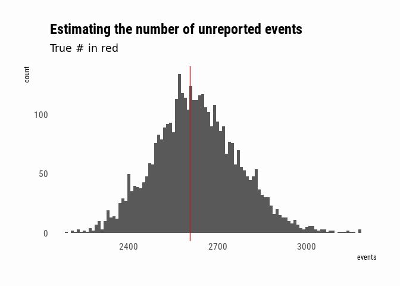
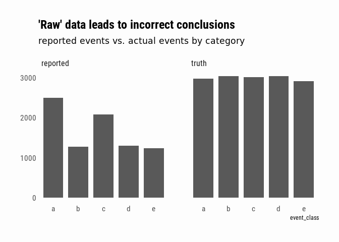
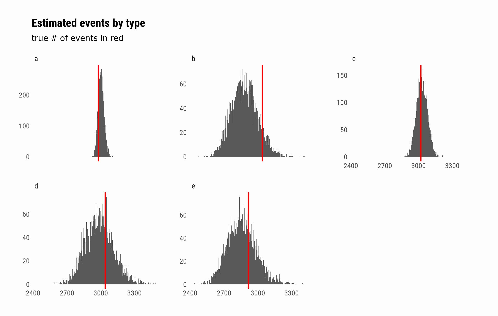

# Multiple systems estimation

## Introduction

It's often necessary to make population inferences when all we have are multiple, incomplete datasets regarding the population. For instance, we could [use a cellphone app to collect reports of bird-sightings from citizen scientists](https://www.thetalkingmachines.com/episodes/overfitting-and-asking-ecological-questions-ml), but then we need to get from bird sightings by cell-phone owners to actual bird populations. Or, we might have [reports of human rights violations](https://amstat.tandfonline.com/doi/abs/10.1080/00031305.2013.821093) from multiple sources. In such cases, we know that not all of the population of interest is represented in the data, and furthermore that the data we do have may be systematically biased (reported bird sightings will track where humans with cell phones are when they see a bird, but that may not represent where most birds are; certain types of victims or abuses may be better- or less-well documented than others).

-   [Simulating data](#simulating-data)
-   [A simple example: random samples](#a-simple-example-random-samples)
-   [Biased sources](#biased-sources)
-   [System dependence](#system-dependence)
-   [Resources](#resources)

Simulating data
---------------

~~~~ r
# requirements
library(tidyverse)
library(brms)
library(tidybayes)

theme_set(
    hrbrthemes::theme_ipsum_rc(grid = FALSE) +
        theme(plot.background = element_rect(
            fill = "#fdfdfd", colour = NA
        )))
~~~~

I'll use simulation to explore the problem. We have, on the one hand, a
series of events that are uniquely identifiable. However, as analysts,
we won't have access to a full census of the events -- instead we'll
have access to one or more reporting sources who provide reports of some
subset of all events. We're interested in both inferring the total
number of events from the incomplete reports, and in understanding the
relative proportions of events of different classes. In other words, we
have to make some inferences about how many events went unreported, and
possibly correct for bias in the reporting sources. By sampling the
unique `event_id` in the simulation, we're assuming that we can
de-duplicate the event reports from multiple sources -- getting data
into such a state is [itself a challenging
problem](https://en.wikipedia.org/wiki/Record_linkage).

~~~~ r
generate_events <- function(
    n = 5000, 
    classes = "a", 
    class_weights = NULL) {
    
    class_weights <- standardize_weights(classes, class_weights)
    
    data_frame(
        event_id    = seq_len(n),
        event_class = sample(names(class_weights), 
                             size = n, 
                             replace = TRUE, 
                             prob = class_weights)
    )
}

## helper function
standardize_weights <- function(classes, class_weights) {
    n_classes <- length(classes)
    
    if (is.null(class_weights)) 
        class_weights <- set_names(rep(1, n_classes), classes)
    
    not_specified <- setdiff(classes, names(class_weights))
    n_not_specified <- length(not_specified)
    
    if (n_not_specified > 0) {
        extra_wts <- set_names(rep(1, n_not_specified), 
                               not_specified)
        class_weights <- c(class_weights, extra_wts)
    }
    
    class_weights / sum(class_weights)
}
~~~~

For example, we can simulate two classes of events where one class is 3
times as prevalent as the other:

~~~~ r
generate_events(classes = c("a", "b"), 
                class_weights = c(a = 3)) %>%
    group_by(event_class) %>% 
    summarise(n = n_distinct(event_id))
~~~~

    ## # A tibble: 2 x 2
    ##   event_class     n
    ##   <chr>       <int>
    ## 1 a            3799
    ## 2 b            1201

A reporting source is simulated by sampling from the population of
events, possibly with bias. To generate multiple reports of events, we
use multiple samples:

~~~~ r
sample_events <- function(events, frac = .1,
                          weights = NULL) {
    
    classes <- unique(events$event_class)
    n_classes <- length(classes)
    weights <- standardize_weights(classes, weights)
    prob <- weights * n_classes
    
    ev <- split(events, events$event_class)
    map2_df(.x = prob, .y = names(prob),
            ~sample_frac(ev[[.y]], size = .x * frac))
}

generate_reports <- function(events, n_reports = 1, ..., from = 1) {
    res <- rerun(n_reports, sample_events(events, ...))
    imap_dfr(res, ~mutate(.x, source = paste0("source", from + .y - 1)))
}
~~~~

A simple example: random samples
--------------------------------

We start with a simple example. There is only one class of event, and we
have no concerns about reports being systematically biased by event
class. We know that the reports are incomplete, and we want to estimate
the true number of events in the population -- this involves estimating
how many events went unreported in all of our sources. We have 4
independent sources.

~~~~ r
set.seed(93730938)
events <- generate_events(n = 5000)
event_reports <- generate_reports(events, n_reports = 4, frac = .15)
~~~~

Since we have access to the data generating process, we know the true
number of events is 5,000. However, a naive summary of the available
data would suggest something much smaller:

~~~~ r
event_reports %>% 
    summarise(n = n_distinct(event_id))
~~~~

    ## # A tibble: 1 x 1
    ##       n
    ##   <int>
    ## 1  2393

The problem we have is analagous to [estimating the number of fish in a
lake](https://uponinspection.wordpress.com/2013/01/16/estimating-the-number-of-jelly-beans-in-the-jar/)
(or jelly beans in a jar) by tagging and releasing a sample and then
counting how many tagged specimens appear in subsequent samples. That
is, we examine not only how many events were reported by individual
sources, but also the number of events reported by multiple sources. If
there are a lot of overlapping reports, we conclude that our sources
have covered a large fraction of the total events and there aren't many
unreported ones. If, on the other hand, there are few overlapping
reports, then we conclude that they are samples from a much larger
space, and that there must be many events that went unreported in all
sources.

~~~~ r
summarize_reports <- function(event_reports) {
    event_reports %>% 
        mutate(placeholder = 1L) %>% 
        spread(source, placeholder, fill = 0L) %>% 
        group_by_at(vars(-event_id)) %>% 
        summarise(n = n_distinct(event_id)) %>% 
        ungroup
}

event_report_smry <-  summarize_reports(event_reports)

event_report_smry
~~~~

    ## # A tibble: 15 x 6
    ##    event_class source1 source2 source3 source4     n
    ##    <chr>         <int>   <int>   <int>   <int> <int>
    ##  1 a                 0       0       0       1   469
    ##  2 a                 0       0       1       0   456
    ##  3 a                 0       0       1       1    86
    ##  4 a                 0       1       0       0   455
    ##  5 a                 0       1       0       1    79
    ##  6 a                 0       1       1       0    79
    ##  7 a                 0       1       1       1    19
    ##  8 a                 1       0       0       0   473
    ##  9 a                 1       0       0       1    68
    ## 10 a                 1       0       1       0    76
    ## 11 a                 1       0       1       1    15
    ## 12 a                 1       1       0       0    86
    ## 13 a                 1       1       0       1    13
    ## 14 a                 1       1       1       0    18
    ## 15 a                 1       1       1       1     1

We'll use the table of counts of events by which sources they were
reported in for our model. What we want to find out is the missing row
in the table -- the number of events that were reported in none of the
sources. The trick we can use is to the model event count `n` (using
poisson regression) in terms of the binary variables encoding presence
in each reporting source. The [intercept of the associated linear
model](https://hrdag.org/2013/03/20/mse-stratification-estimation/#Q14)
then tells us the number of events when the indicator variable for every
source is equal to 0. (Since there is only one event class, I'm ignoring
that for now).

~~~~ r
event_data_model <- brm(n ~ source1 + source2 + source3 + source4,
                        data = event_report_smry, 
                        family = poisson(link = "log"),
                        cores = 4)
~~~~

    ## Compiling the C++ model

    ## Start sampling

~~~~ r
event_data_model
~~~~

    ##  Family: poisson 
    ##   Links: mu = log 
    ## Formula: n ~ source1 + source2 + source3 + source4 
    ##    Data: event_report_smry (Number of observations: 15) 
    ## Samples: 4 chains, each with iter = 2000; warmup = 1000; thin = 1;
    ##          total post-warmup samples = 4000
    ## 
    ## Population-Level Effects: 
    ##           Estimate Est.Error l-95% CI u-95% CI Eff.Sample Rhat
    ## Intercept     7.87      0.05     7.77     7.98       1488 1.00
    ## source1      -1.74      0.05    -1.84    -1.64       1663 1.00
    ## source2      -1.74      0.05    -1.84    -1.64       1827 1.00
    ## source3      -1.74      0.05    -1.85    -1.64       1860 1.00
    ## source4      -1.74      0.05    -1.85    -1.64       1890 1.00
    ## 
    ## Samples were drawn using sampling(NUTS). For each parameter, Eff.Sample 
    ## is a crude measure of effective sample size, and Rhat is the potential 
    ## scale reduction factor on split chains (at convergence, Rhat = 1).

To make inferences about the number of unreported events, I can just
sample from the Intercept parameter of the model. Since I used a
log-link function, I exponentiate to get back to meaningful units. Since
in this case I do happen to know the true number of unreported events, I
can compare:

~~~~ r
posterior <- posterior_samples(event_data_model, pars = "Intercept") %>% 
    mutate(events = exp(b_Intercept))

unreported_events <- length(setdiff(events$event_id, event_reports$event_id))

ggplot(posterior, aes(x = events)) + 
    geom_histogram(binwidth = 10) + 
    geom_vline(xintercept = unreported_events, colour = "red") +
    labs(title    = "Estimating the number of unreported events",
         subtitle = "True # in red")
~~~~

Biased sources
--------------

As discussed in the introduction, in real life it is generally the case
that our reporting sources are not unbiased. If we have a situation
where events can belong to different event classes, and the reports
over- or under-represent certain classes, can we still make defensible
inferences about the underlying population? For this example, we'll
simulate events that can take one of 5 different classes, but our data
will include two sources that over-represent certain classes.

~~~~ r
set.seed(307037)
complex_events <- generate_events(n = 15000, classes = letters[1:5])

complex_event_reports <- 
    bind_rows(
        generate_reports(events = complex_events, 
                         n_reports = 4, frac = .1, from = 1),
        generate_reports(events = complex_events, 
                         n_reports = 2, frac = .2, 
                         weights = c(a = 8, c = 5), from = 5)
    )
~~~~

A naive analysis of this data might conclude that, even if we don't know
the exact number of events since our reports are incomplete, we can say
that events "a" and "c" are more prevalent. In fact, we would only be
describing the bias of our reporting sources:

~~~~ r
complex_event_reports %>% 
    bind_rows(complex_events %>% mutate(source = "truth")) %>% 
    mutate(source = ifelse(str_detect(source, "source"), 
                           "reported", "truth")) %>% 
    group_by(source, event_class) %>% 
    summarise(n = n_distinct(event_id)) %>% 
    ggplot(aes(x = event_class, y = n)) +
    geom_col(width = .8) + 
    facet_wrap(~source) +
    labs(title    = "'Raw' data leads to incorrect conclusions",
         subtitle = "reported events vs. actual events by category") +
    theme(axis.title.y = element_blank())
~~~~

We'll set up the data for the model as before:

~~~~ r
complex_event_report_smry <- summarize_reports(complex_event_reports)
complex_event_report_smry
~~~~

    ## # A tibble: 211 x 8
    ##    event_class source1 source2 source3 source4 source5 source6     n
    ##    <chr>         <int>   <int>   <int>   <int>   <int>   <int> <int>
    ##  1 a                 0       0       0       0       0       1   498
    ##  2 a                 0       0       0       0       1       0   476
    ##  3 a                 0       0       0       0       1       1   500
    ##  4 a                 0       0       0       1       0       0    54
    ##  5 a                 0       0       0       1       0       1    50
    ##  6 a                 0       0       0       1       1       0    57
    ##  7 a                 0       0       0       1       1       1    54
    ##  8 a                 0       0       1       0       0       0    51
    ##  9 a                 0       0       1       0       0       1    48
    ## 10 a                 0       0       1       0       1       0    63
    ## # ... with 201 more rows

I can imagine the same sort of model as we used in the simpler case
above. If a particular class of event appears in more intersections than
another, I can infer that it is over-represented in the data.

~~~~ r
complex_event_data_model <- 
    brm(n ~ (1 + source1 + source2 + source3 + 
                 source4 + source5 + source6) | p | event_class,
        data = complex_event_report_smry, family = poisson(), 
        control = list(adapt_delta = .95, max_treedepth = 15), 
        iter = 3000, chains = 4,
        cores = 4)
~~~~

    ## Compiling the C++ model

    ## Start sampling

    ## Warning: There were 37 divergent transitions after warmup. Increasing adapt_delta above 0.95 may help. See
    ## http://mc-stan.org/misc/warnings.html#divergent-transitions-after-warmup

    ## Warning: Examine the pairs() plot to diagnose sampling problems

Once again, I can use the intercept of the linear model to estimate the
number of unreported events. This time around, I've modeled a global
intercept (called `b_Intercept`) as well as offsets from the global
intercept for each class. After adding them together, I exponentiate as
before to return to the events-scale. `tidybayes::spread_draws` allows
me to sample the parameters I'm interested in:

~~~~ r
ce_estimates <- complex_event_data_model %>% 
    spread_draws(r_event_class[class, param], b_Intercept) %>% 
    filter(param == "Intercept") %>% 
    mutate(unreported_est = exp(r_event_class + b_Intercept)) %>% 
    ungroup

ce_estimates
~~~~

    ## # A tibble: 30,000 x 8
    ##    .chain .iteration .draw class param r_event_class b_Intercept
    ##     <int>      <int> <int> <chr> <chr>         <dbl>       <dbl>
    ##  1      1          1     1 a     Inte…       -2.02          8.28
    ##  2      1          1     1 b     Inte…       -1.05          8.28
    ##  3      1          1     1 c     Inte…       -1.45          8.28
    ##  4      1          1     1 d     Inte…       -0.795         8.28
    ##  5      1          1     1 e     Inte…       -0.909         8.28
    ##  6      1          2     2 a     Inte…       -1.37          7.54
    ##  7      1          2     2 b     Inte…       -0.0782        7.54
    ##  8      1          2     2 c     Inte…       -0.659         7.54
    ##  9      1          2     2 d     Inte…       -0.0439        7.54
    ## 10      1          2     2 e     Inte…       -0.252         7.54
    ## # ... with 29,990 more rows, and 1 more variable: unreported_est <dbl>

I'll also add back in the reported numbers in order to output an
estimate of the total number of events by class. Finally, plot these
estimates against the true population data from `complex_events`:

~~~~ r
reported_by_class <- complex_event_reports %>% 
    group_by(class = event_class) %>% 
    summarise(n_reported = n_distinct(event_id))

actual_by_class <- complex_events %>% 
    group_by(class = event_class) %>% 
    summarise(n = n_distinct(event_id))

ce_estimates %>% 
    inner_join(reported_by_class, by = "class") %>% 
    mutate(estimated = n_reported + unreported_est) %>% 
    ggplot(aes(x = estimated)) + 
    geom_histogram(binwidth = 3) + 
    facet_wrap(~class, scales = "free_y") + 
    geom_vline(data = actual_by_class, aes(xintercept = n), 
               colour = "red", size = 1) +
    theme(axis.title.x = element_blank(),
          axis.title.y = element_blank()) +
    labs(title    = "Estimated events by type",
         subtitle = "true # of events in red")
~~~~

 

System dependence
-----------------

This post did not explore the phenomenon of "system dependence" -- when
an event's appearance on one list makes it more or less likely to appear
on another list. For instance, according to [this overview by Lum,
Price, and
Banks](http://www.tandfonline.com/doi/full/10.1080/00031305.2013.821093#.UoqB2Y2oW14),
in the context of documenting human rights abuses,

> This was a major problem in the Colombia case study highlighted in
> Section 3.3, where Benetech analyzed lists collected by both
> government agencies and nongovernmental organizations (NGOs). Negative
> dependence occurred because people who were inclined to report a
> violation to an NGO were less likely to trust the government (and vice
> versa). Positive dependence occurred because records of homicides kept
> by the National Police were partially subsumed in the list of
> violations collected by the Office of the Vice Presidency, and both
> lists were among those used in the analysis.

The approaches presented in that paper involve adding interaction terms
to the model -- in fact, looking at every possible model based on
presence or absence of each interaction and then either picking the best
model or averaging over them. I wondered if I could cheat by modeling
the correlation among the linear model coefficients directly, but I
didn't have much luck.

Resources
---------

Much of what was presented here is based on my understanding of the
thorough 5-part FAQ over at the [HRDAG
website](https://hrdag.org/2013/03/11/mse-the-basics/), Patrick Ball's
[blog post](https://hrdag.org/tech-notes/basic-mse.html) about the
topic, and the paper by [Lum, Price, and
Banks](http://www.tandfonline.com/doi/full/10.1080/00031305.2013.821093#.UoqB2Y2oW14)
(paywalled).
