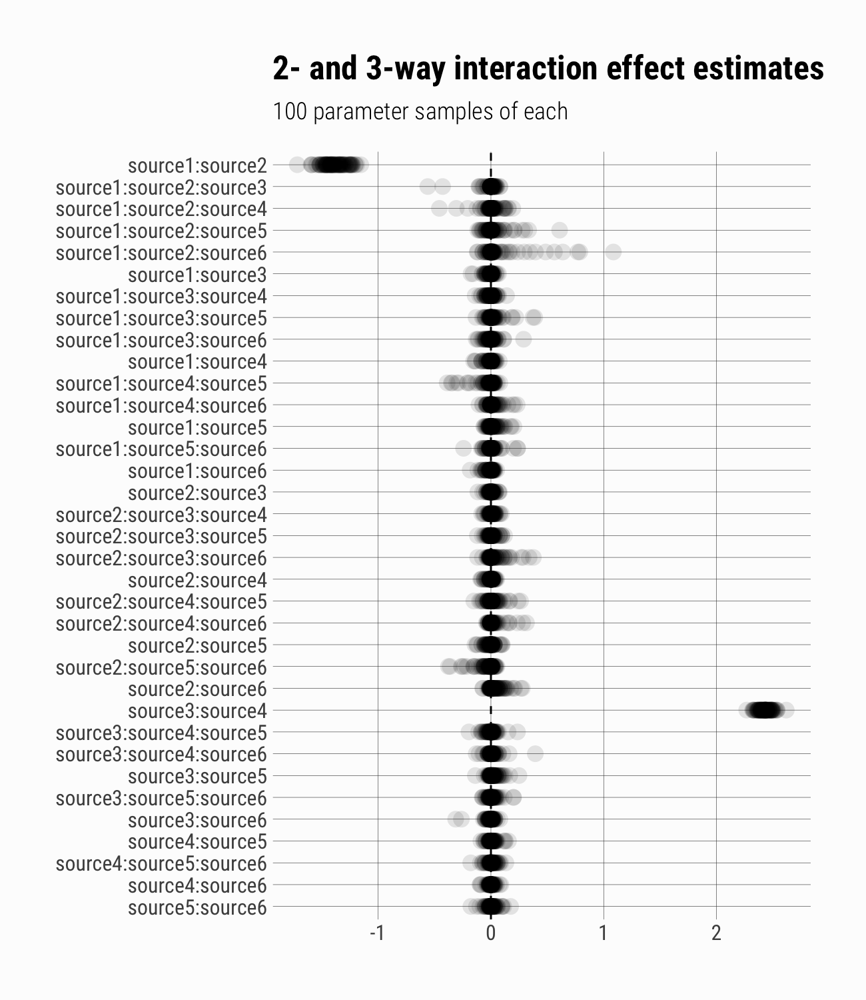

I'll start with the data-simulation functions from [the original
post](https://tarakc02.github.io/mse/):

~~~~ r
ls()
~~~~

    ## [1] "generate_events"     "generate_reports"    "sample_events"      
    ## [4] "standardize_weights" "summarize_reports"

Next, I simulate list dependence by creating pairs of reports, the first
element is generated as usual, the second is sampled from the original
events data using different probabilities depending on whether the event
was documented in the first report.

~~~~ r
dependent_reports <- function(events,
                              frac, ...,
                              dup_prob, else_prob,
                              from = 1) {
    s <- sample_events(events, frac, ...)
    t <- events %>%
        left_join(s, by = "event_id") %>%
        transmute(event_id,
                  event_class = event_class.x,
                  in_s = !is.na(event_class.y),
                  sample_prob = ifelse(in_s, dup_prob, else_prob)) %>%
        sample_frac(frac, weight = sample_prob) %>%
        select(event_id, event_class)
    imap_dfr(list(s, t), ~mutate(.x, source = paste0("source", from + .y - 1)))
}
~~~~

In this example, I generate 15000 original events, along with 6
reporting sources, 2 of them exhibit positive dependence in addition to
`event_class`-based selection bias, two exhibit negative dependence, and
the last two exhibit selection bias but not list dependence.

~~~~ r
set.seed(3970673)
events <- generate_events(n = 15000, classes = letters[1:5])

reports <- bind_rows(
    dependent_reports(
        events,
        frac = .15, weights = c(a = 5, d = .5),
        dup_prob = .05, else_prob = .2
    ), 
    dependent_reports(
        events,
        frac = .2, 
        dup_prob = .8, else_prob = .1,
        from = 3
    ),
    generate_reports(events, n_reports = 2, from = 5,
                     weights = c(b = 10))
)
~~~~

Now I'll create the documentation pattern summary, and attempt to fit
the model from before, that does not include interaction effects:

~~~~ r
report_smry <- summarize_reports(reports)
~~~~

~~~~ r
small_model <- 
    brm(n ~ (1 + source1 + source2 + source3 + 
                 source4 + source5 + source6) | p | event_class,
        data = report_smry, family = poisson(), 
        control = list(adapt_delta = .95, max_treedepth = 15), 
        iter = 5000, chains = 4, cores = 4)
~~~~

    ## Compiling the C++ model

    ## recompiling to avoid crashing R session

    ## Start sampling

    ## Warning: There were 822 divergent transitions after warmup. Increasing adapt_delta above 0.95 may help. See
    ## http://mc-stan.org/misc/warnings.html#divergent-transitions-after-warmup

    ## Warning: Examine the pairs() plot to diagnose sampling problems

I'll borrow from the original post's code to make a custom plotting
function -- this takes a model along with actual and reported event
counts and plots estimates drawn from the model posterior against actual
event counts.

~~~~ r
plot_estimates <- function(actual, reported, estimates, 
                           title = "Estimated events by type") {
    estimates <- estimates %>% 
        inner_join(reported, by = "class") %>% 
        mutate(estimated = n_reported + unreported_est)

    ggplot(estimates,
           aes(x = estimated)) + 
        geom_histogram(binwidth = 7) + 
        geom_vline(data = actual,
                   aes(xintercept = n), 
                   colour = "red",
                   size = 1) +
        facet_wrap(~class, scales = "free_y") + 
        theme(axis.title.x = element_blank(),
              axis.title.y = element_blank()) +
        labs(title    = title,
             subtitle = "true # of events in red")
}
~~~~

The `small_model`, without any interaction effects, does not do a good
job of estimating the true numbers of events:

~~~~ r
reported_by_class <- reports %>% 
    group_by(class = event_class) %>% 
    summarise(n_reported = n_distinct(event_id))

actual_by_class <- events %>% 
    group_by(class = event_class) %>% 
    summarise(n = n_distinct(event_id))

small_model_estimates <- small_model %>% 
    spread_draws(r_event_class[class, param], b_Intercept) %>% 
    filter(param == "Intercept") %>% 
    mutate(unreported_est = exp(r_event_class + b_Intercept)) %>% 
    ungroup

plot_estimates(actual    = actual_by_class,
               reported  = reported_by_class,
               estimates = small_model_estimates,
               title     = "Event estimates (no interaction effects)")
~~~~

So I expand on the smaller model, by including interaction effects. Here
I model every possible interaction, and use the
[horseshoe](https://arxiv.org/abs/1610.05559) as a prior on the
interaction effects.

~~~~ r
interaction_fx_form <-
    bf(n ~ main + interaction,
       # main fx formula is the same as before
       main        ~ (1 + source1 + source2 + source3 +
                          source4 + source5 + source6) | event_class,
       # only estimate population-level interaction effects, not group-level
       interaction ~ 0 + (source1 + source2 + source3 +
                          source4 + source5 + source6) ^ 6 - .,
       family = poisson(),
       nl = TRUE)

priors <- c(prior(normal(0, 5), nlpar = "main"),
            prior(horseshoe(), nlpar  = "interaction"))

big_model <- brm(interaction_fx_form,
                 data  = report_smry,
                 prior = priors,
                 iter  = 5000, chains = 4, cores = 4)
~~~~

    ## Compiling the C++ model

    ## recompiling to avoid crashing R session

    ## Start sampling

    ## Warning: There were 97 divergent transitions after warmup. Increasing adapt_delta above 0.8 may help. See
    ## http://mc-stan.org/misc/warnings.html#divergent-transitions-after-warmup

    ## Warning: There were 7385 transitions after warmup that exceeded the maximum treedepth. Increase max_treedepth above 10. See
    ## http://mc-stan.org/misc/warnings.html#maximum-treedepth-exceeded

    ## Warning: Examine the pairs() plot to diagnose sampling problems

I need to draw from the intercept parameters to estimate the number of
unreported events. The `get_variables` function helps to look for the
names of the appropriate model parameters.

~~~~ r
get_variables(big_model) %>%
    keep(~str_detect(., "[iI]ntercept"))
~~~~

    ##  [1] "b_main_Intercept"                             
    ##  [2] "sd_event_class__main_Intercept"               
    ##  [3] "cor_event_class__main_Intercept__main_source1"
    ##  [4] "cor_event_class__main_Intercept__main_source2"
    ##  [5] "cor_event_class__main_Intercept__main_source3"
    ##  [6] "cor_event_class__main_Intercept__main_source4"
    ##  [7] "cor_event_class__main_Intercept__main_source5"
    ##  [8] "cor_event_class__main_Intercept__main_source6"
    ##  [9] "r_event_class__main[a,Intercept]"             
    ## [10] "r_event_class__main[b,Intercept]"             
    ## [11] "r_event_class__main[c,Intercept]"             
    ## [12] "r_event_class__main[d,Intercept]"             
    ## [13] "r_event_class__main[e,Intercept]"

This time around, the model does a better job of estimating the true
counts:

~~~~ r
big_model_estimates <- big_model %>%
    spread_draws(r_event_class__main[class, param], b_main_Intercept) %>%
    filter(param == "Intercept") %>% 
    mutate(unreported_est = exp(r_event_class__main + b_main_Intercept)) %>% 
    ungroup

plot_estimates(actual    = actual_by_class,
               reported  = reported_by_class,
               estimates = big_model_estimates,
               title     = "Event count estimates (with interactions)")
~~~~

The `tidybayes` package includes functions `spread_draws` and
`gather_draws` which return tidy draws from the posterior distribution
of Stan models, and further allow you to select parameters to draw using
regular expressions. First I'll find the template for the parameter
names:

~~~~ r
get_variables(big_model) %>%
    keep(~str_detect(., "interaction"))
~~~~

    ##  [1] "b_interaction_source1:source2"                                
    ##  [2] "b_interaction_source1:source3"                                
    ##  [3] "b_interaction_source1:source4"                                
    ##  [4] "b_interaction_source1:source5"                                
    ##  [5] "b_interaction_source1:source6"                                
    ##  [6] "b_interaction_source2:source3"                                
    ##  [7] "b_interaction_source2:source4"                                
    ##  [8] "b_interaction_source2:source5"                                
    ##  [9] "b_interaction_source2:source6"                                
    ## [10] "b_interaction_source3:source4"                                
    ## [11] "b_interaction_source3:source5"                                
    ## [12] "b_interaction_source3:source6"                                
    ## [13] "b_interaction_source4:source5"                                
    ## [14] "b_interaction_source4:source6"                                
    ## [15] "b_interaction_source5:source6"                                
    ## [16] "b_interaction_source1:source2:source3"                        
    ## [17] "b_interaction_source1:source2:source4"                        
    ## [18] "b_interaction_source1:source2:source5"                        
    ## [19] "b_interaction_source1:source2:source6"                        
    ## [20] "b_interaction_source1:source3:source4"                        
    ## [21] "b_interaction_source1:source3:source5"                        
    ## [22] "b_interaction_source1:source3:source6"                        
    ## [23] "b_interaction_source1:source4:source5"                        
    ## [24] "b_interaction_source1:source4:source6"                        
    ## [25] "b_interaction_source1:source5:source6"                        
    ## [26] "b_interaction_source2:source3:source4"                        
    ## [27] "b_interaction_source2:source3:source5"                        
    ## [28] "b_interaction_source2:source3:source6"                        
    ## [29] "b_interaction_source2:source4:source5"                        
    ## [30] "b_interaction_source2:source4:source6"                        
    ## [31] "b_interaction_source2:source5:source6"                        
    ## [32] "b_interaction_source3:source4:source5"                        
    ## [33] "b_interaction_source3:source4:source6"                        
    ## [34] "b_interaction_source3:source5:source6"                        
    ## [35] "b_interaction_source4:source5:source6"                        
    ## [36] "b_interaction_source1:source2:source3:source4"                
    ## [37] "b_interaction_source1:source2:source3:source5"                
    ## [38] "b_interaction_source1:source2:source3:source6"                
    ## [39] "b_interaction_source1:source2:source4:source5"                
    ## [40] "b_interaction_source1:source2:source4:source6"                
    ## [41] "b_interaction_source1:source2:source5:source6"                
    ## [42] "b_interaction_source1:source3:source4:source5"                
    ## [43] "b_interaction_source1:source3:source4:source6"                
    ## [44] "b_interaction_source1:source3:source5:source6"                
    ## [45] "b_interaction_source1:source4:source5:source6"                
    ## [46] "b_interaction_source2:source3:source4:source5"                
    ## [47] "b_interaction_source2:source3:source4:source6"                
    ## [48] "b_interaction_source2:source3:source5:source6"                
    ## [49] "b_interaction_source2:source4:source5:source6"                
    ## [50] "b_interaction_source3:source4:source5:source6"                
    ## [51] "b_interaction_source1:source2:source3:source4:source5"        
    ## [52] "b_interaction_source1:source2:source3:source4:source6"        
    ## [53] "b_interaction_source1:source2:source3:source5:source6"        
    ## [54] "b_interaction_source1:source2:source4:source5:source6"        
    ## [55] "b_interaction_source1:source3:source4:source5:source6"        
    ## [56] "b_interaction_source2:source3:source4:source5:source6"        
    ## [57] "b_interaction_source1:source2:source3:source4:source5:source6"
    ## [58] "hs_c2_interaction"

Here I'll use a regular expression to draw samples of just the 2- and
3-way interaction effects. By plotting the first 100 draws, I see that
the model correctly picked up on the underlying dependence structure.

~~~~ r
interaction_draws <- gather_draws(
    big_model,
    `b_interaction_([^\\:]+\\:){1,2}[^\\:]+$`,
    regex = TRUE
) %>% ungroup

interaction_draws <- interaction_draws %>%
    mutate(.variable = str_replace(.variable, "^b_interaction_", ""))

interaction_draws %>%
    filter(.draw <=100) %>%
    ggplot(aes(x = fct_rev(.variable), y = .value)) +
    geom_point(alpha  = .1,
               size   = .4,
               stroke = NA) +
    geom_hline(yintercept = 0, linetype = 2, size = .5) + 
    coord_flip() +
    ggtitle("2- and 3-way interaction effect estimates",
            "100 parameter samples of each") + 
    theme(panel.grid.major = element_line(
                                size   = .1,
                                colour = "grey25"
                             ),
          axis.title.x     = element_blank(),
          axis.title.y     = element_blank())
~~~~

