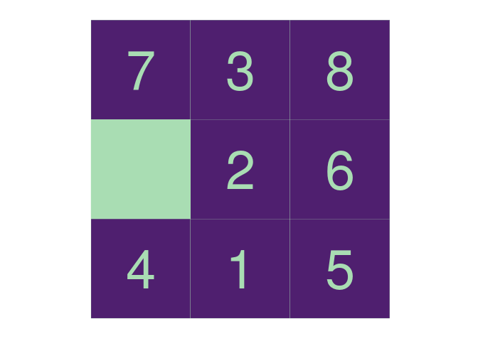
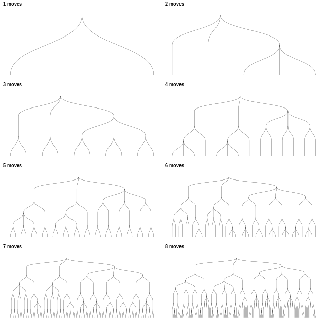
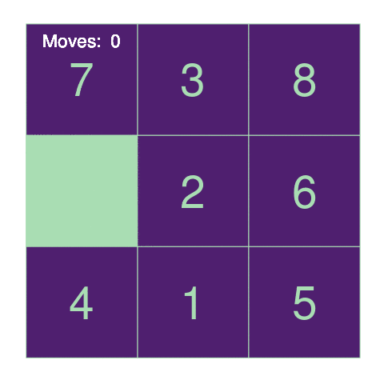
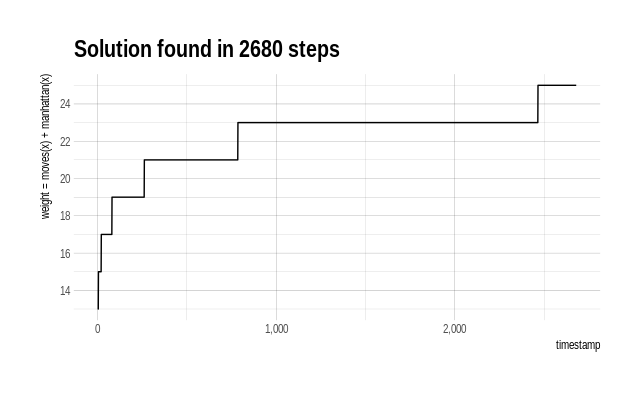
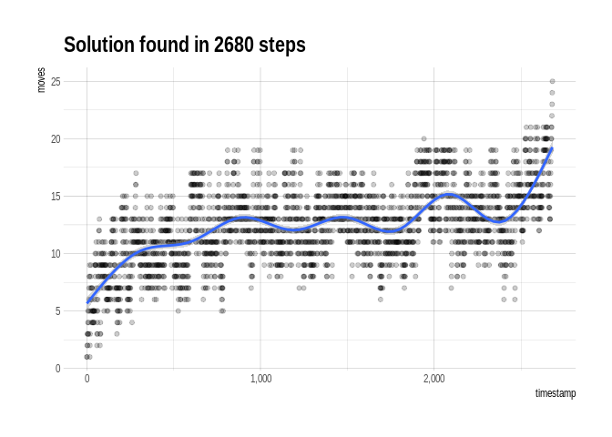
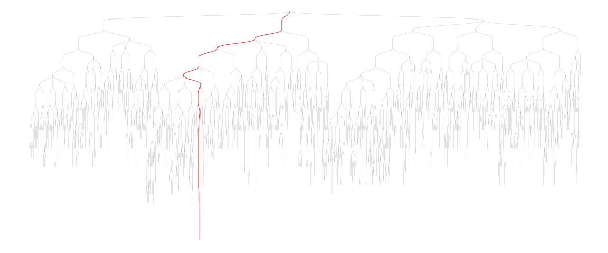

The 8-puzzle
------------

The 8-puzzle is a game featuring a set of 8 numbered tiles on a 3x3 grid
(leaving one blank cell). The objective is to get the tiles in numerical
order by sliding them. The [puzzlr
package](https://github.com/tarakc02/puzzlr) provides basic functions
for creating and manipulating game boards.

~~~~ r
library(puzzlr)
set.seed(9803808)
p <- random_puzzle(size = 3)

plot(p)
~~~~

So, for instance, on this board I can move the 2 to the left, the 7
down, or the 4 up. The function `neighbors()` generates all possible
moves from a given game state:

~~~~ r
neighbors(p)
~~~~

    ## [[1]]
    ##   . 3 . 8
    ## 7 . 2 . 6
    ## 4 . 1 . 5
    ## 
    ## [[2]]
    ## 7 . 3 . 8
    ## 4 . 2 . 6
    ##   . 1 . 5
    ## 
    ## [[3]]
    ## 7 . 3 . 8
    ## 2 .   . 6
    ## 4 . 1 . 5

Each move produces a new board that also holds a pointer to the previous
board, so that we can always replay the moves we used to get to a
particular state:

~~~~ r
# the move() function requires the coordinates of the source and 
# destination tile here i move the 7 down into the blank spot
moved_once <- move(p, source = c(1, 1), dest = c(2, 1))
replay_moves(moved_once)
~~~~

    ## [[1]]
    ## 7 . 3 . 8
    ##   . 2 . 6
    ## 4 . 1 . 5
    ## 
    ## [[2]]
    ##   . 3 . 8
    ## 7 . 2 . 6
    ## 4 . 1 . 5

Solving the puzzle
------------------

I'd like to find the solution that requires the fewest moves. The way I
propose to do that is to generate a list of every playable game (here I
define a "playable game" to be any possible sequence of moves), and then
search through that list for those that end in the solution state.
Finally, I take the one that has the fewest moves.

Alas, there are a frightful number of such games. From each puzzle
state, there are 2 - 4 possible moves, so there are between
2*n* and 4*n* games of length *n*. Clearly I can't
expect to generate all possible games more than a dozen or so moves out.
Instead of materializing all of them, I use the [lazylist
package](https://github.com/tarakc02/lazylist/) to create a lazily
evaluated list, or "stream," of playable games of every length. If I
construct the stream in such a way that the most promising games appear
first, I can pick through the stream in order until I happen across a
solution. Since the stream is lazily evaluated, I only have to expend
the resources to generate the games that I actually investigate, rather
than every possible one. If my ability to evaluate how "promising" a
sequence is is any good, then I can constrain my efforts to a small
fraction of the full solution space.

To construct a stream of all possible games playable from a given puzzle
state, I generate all games of 1 move, and then recursively generate all
possible games off of each of those. Finally, I braid together the
resulting streams of games, ordering them by a `weight_function`:

~~~~ r
library(lazylist)
all_games_from <- function(pz, weight_function) {
    possible_next_moves <- puzzlr::neighbors(pz)
    
    possible_moves <- purrr::map(
        possible_next_moves, 
        function(x) 
            cons_stream(x, all_games_from(x, weight_function) )
    )
    
    purrr::reduce(possible_moves, 
           merge_weighted, 
           weight = weight_function)
}
~~~~

This is all a bit mind-bending if you're not used to this style of
programming. This ability to define data structures recursively allows
us to model our problem in a more abstract way -- we create objects
representing not a single move, but rather every possible sequence of
moves, and then manipulate these higher-level objects. The
`merge_weighted` function appears to be doing a lot of heavy lifting
here, but a [look at the source
code](https://github.com/tarakc02/lazylist/blob/master/R/merge_weighted.R)
shows that it, too, has a surprisingly simple implementation. This is
all possible due to the magic of lazy evaluation.

The `weight_function` is the key to how efficiently our algorithm will
find a solution. The `neighbors()` function avoids any move that would
put the puzzle back into the same state it was one move previously, but
still the number of possible states that the game can reach grows
quickly as the number of moves increases:

So the fewer alternative routes we can visit at each stage, the more
quickly we'll find the shortest solution to the puzzle. An algorithm for
solving just such a problem is the [A\*
algorithm](https://en.wikipedia.org/wiki/A*_search_algorithm), which
guarantees we'll find the shortest solution to the puzzle (given one
exists), as long as our `weight_function` has this form:

    moves(x) + ???(x)

`moves()` tells us how many moves were required to get the puzzle to
it's current state. `???()` is an estimate of the number of moves
remaining to the solution, and is called a *heuristic*. We can guarantee
that we'll find the shortest possible solution if we know that `???()`
never overestimates the number of moves remaining. However, the closer
it comes to correctly estimating, the more possible game paths we'll be
able to ignore, thus reducing the time required to identify the game
path corresponding to the solution. We want `???()` to get as close as
possible to the true number of moves remaining without going over.

The `puzzlr` package provides two built-in heuristics, `hamming()` and
`manhattan()`. We'll use the manhattan distance:

~~~~ r
mh_cost <- function(x) moves(x) + manhattan(x)
all_games <- all_games_from(p, weight_function = mh_cost)
~~~~

Now that we have a stream representing every possible sequence of moves
for our puzzle, we just pick out the ones that result in solutions. We
know we're at a solution if the manhattan distance is equal to 0, so:

~~~~ r
is_solution <- function(x) manhattan(x) == 0
solutions <- stream_filter(all_games, is_solution)
~~~~

To view the shortest solution:

~~~~ r
animate_moves(solutions[1])
~~~~

Analyzing performance
---------------------

One advantage to working with streams is that we now have access to the
entire history of the search process.

`all_games` includes every possible playable game, though I didn't have
to evaluate every element, so I didn't have to investigate every
possible game. I did, however, have to investigate every game in
`all_games` up to the first solution. I can review how many games I had
to investigate:

~~~~ r
solution_index <- stream_which(all_games, is_solution)
solution_index[1]
~~~~

    ## [1] 2680

The eventual solution was 25 moves, and based on the earlier discussion
I know that there are between 33,554,432 and 1,125,899,906,842,624
possible games of length 25, so I guess 2,680 doesn't seem so bad. Let's
look in more detail at what happened:

~~~~ r
library(tidyverse)
investigated <- as.list(all_games, from = 1, to = solution_index[1])
investigated_df <- imap_dfr(
    investigated, 
    ~data_frame(timestamp = .y, 
                moves = moves(.x),
                manhattan = manhattan(.x),
                hamming = hamming(.x)))
investigated_df
~~~~

    ## # A tibble: 2,680 x 4
    ##    timestamp moves manhattan hamming
    ##        <int> <int>     <int>   <int>
    ##  1         1     1        12       7
    ##  2         2     1        12       6
    ##  3         3     2        11       6
    ##  4         4     3        10       6
    ##  5         5     2        13       7
    ##  6         6     3        12       6
    ##  7         7     4        11       6
    ##  8         8     5        10       6
    ##  9         9     3        12       7
    ## 10        10     3        12       6
    ## # ... with 2,670 more rows

Let's look at the values taken by the `weight_function` during the
search:

~~~~ r
investigated_df %>%
    mutate(weight = moves + manhattan) %>%
    ggplot(aes(x = timestamp, y = weight)) + 
    geom_line() + 
    hrbrthemes::theme_ipsum() +
    scale_x_continuous(labels = scales::comma) + 
    scale_y_continuous(breaks = seq(from = 12, to = 26, by = 2),
                       name = "weight = moves(x) + manhattan(x)") +
    ggtitle(paste("Solution found in", solution_index[1], "steps"))
~~~~

I spent a lot of time looking at puzzle states that had weight 23. If
there were some way of differentiating among these, maybe I could save
some time. I see a similar story when looking at the number of moves of
each investigated game state.

~~~~ r
investigated_df %>%
    ggplot(aes(x = timestamp, y = moves)) + 
    geom_point(alpha = .2) + 
    geom_smooth() + 
    hrbrthemes::theme_ipsum() +
    scale_x_continuous(labels = scales::comma) + 
    ggtitle(paste("Solution found in", solution_index[1], "steps"))
~~~~

    ## `geom_smooth()` using method = 'gam' and formula 'y ~ s(x, bs = "cs")'

We spent a majority of the time investigating various games with lengths
between 10 and 15, but once we discovered the correct path, we made our
way to the full 25-move solution without much more dawdling.

At each step of a game, we choose between a number of available moves.
So the overall search can be viewed as a directed graph, where we are
searching for the correct path down the graph. Visualizing our search in
terms of this graph tells a similar story, where we explored a large
number of mid-length games before identifying the one that would lead to
the solution, but once we found it we were able to move down it quickly
without exploring its neighbors:

~~~~ r
library(tidygraph)
library(ggraph)

# use digest::digest to create a unique identifier for each game
game_graph <- map_dfr(
    investigated,
    ~data_frame(from = digest::digest(puzzlr::parent(.)),
                to = digest::digest(.),
                moves = moves(.)))

# identify the correct path in the graph so that we can highlight it
solution_step_ids <- map_chr(replay_moves(solutions[1]),
                             digest::digest)

game_graph <- game_graph %>% 
    mutate(is_solution = to %in% solution_step_ids)

as_tbl_graph(game_graph) %>%
    ggraph(layout = "igraph", algorithm = "tree") + 
    geom_edge_diagonal0(aes(colour = is_solution,
                            width = is_solution)) + 
    scale_edge_colour_manual(values = c("TRUE" = "red",
                                        "FALSE" = "gray60"),
                             guide = "none") +
    scale_edge_width_manual(values = c("TRUE" = .3,
                                       "FALSE" = .1),
                            guide = "none") +
    theme_void()
~~~~

